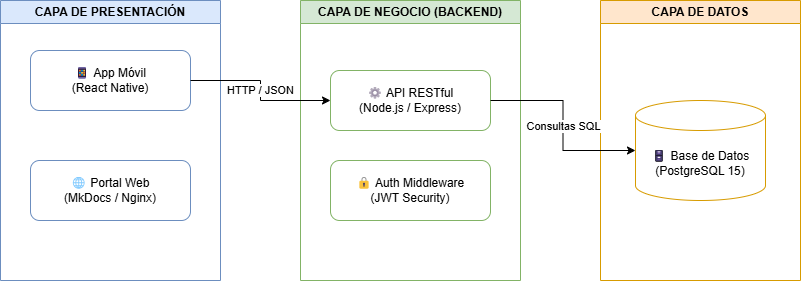

# 🏗️ Manual Técnico de Arquitectura y Despliegue

Este documento detalla la estructura física y lógica del sistema, los requisitos de infraestructura del servidor y el procedimiento para empaquetar el portal mediante contenedores Docker.

---

## 1. Arquitectura de Despliegue (Modelo de 3 Capas)

El sistema está diseñado bajo un modelo distribuido de **3 capas**, garantizando el aislamiento de responsabilidades y la alta disponibilidad de los servicios:

```text
+-------------------------------------------------------------------+
|                     CAPA DE PRESENTACIÓN                          |
|  - Aplicación Móvil (React Native)                                |
|  - Portal Web de Documentación (Nginx / MkDocs)                   |
+-------------------------------------------------------------------+
                                  │
                                  │ (Peticiones HTTP / JSON)
                                  ▼
+-------------------------------------------------------------------+
|                       CAPA DE NEGOCIO                             |
|  - Servidor REST API (Node.js / Express)                          |
|  - Middleware de Autenticación (JWT)                              |
+-------------------------------------------------------------------+
                                  │
                                  │ (Consultas SQL)
                                  ▼
+-------------------------------------------------------------------+
|                        CAPA DE DATOS                              |
|  - Motor de Base de Datos (PostgreSQL 15)                         |
+-------------------------------------------------------------------+

## 2. Requisitos Mínimos de Infraestructura

| Recurso | Requisito Mínimo | Requisito Recomendado |
| :--- | :--- | :--- |
| **Procesador (CPU)** | 2 vCPU a 2.0 GHz | 4 vCPU a 2.5 GHz o superior |
| **Memoria RAM** | 4 GB | 8 GB |
| **Almacenamiento** | 20 GB SSD | 50 GB SSD NVMe |
| **Sistema Operativo** | Ubuntu Server 22.04 LTS | Ubuntu Server 22.04 LTS |
| **Red & Puertos** | IP Pública (Puertos 80, 443, 5432) | IP Pública con Firewall / HTTPS |

---

## 3. Despliegue Contenerizado con Docker

### Diagrama de Apoyo de la Arquitectura
<!-- AQUÍ COLOCAS LA RUTA DE TU IMAGEN -->


---

### Construcción y Ejecución del Contenedor

#### 1. Construir la Imagen de Docker
```bash
docker build -t portal-documentacion:v1 .